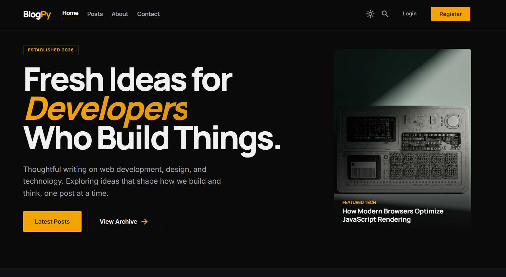
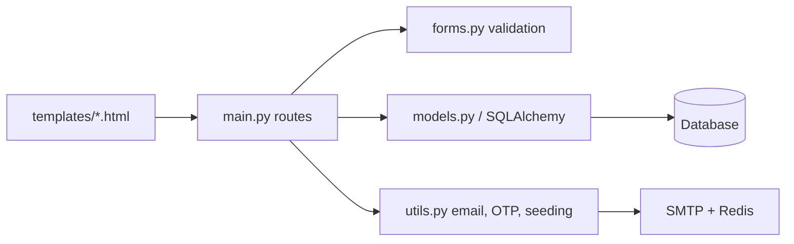
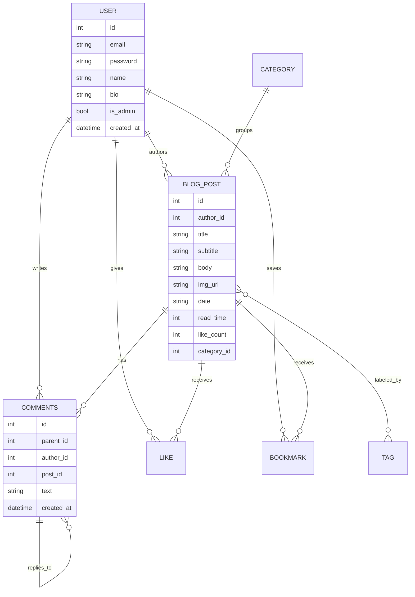

# BlogPy — Full-Stack Flask Blog Website

<div align="center">
  

  [](https://blogpy.vercel.app)
  [](https://python.org)
  [](https://flask.palletsprojects.com)
  [](https://vercel.com)
</div>

BlogPy is a Flask-based blogging platform that combines authentication, post publishing, discussions, engagement tools, and deployment-ready infrastructure in one app. It uses SQLAlchemy for data modeling, Flask-Login for sessions, Flask-WTF for forms and CSRF protection, Flask-Limiter for throttling, CKEditor for rich text editing, and SMTP/Redis helpers for email and OTP flows.

## Links

- Live demo: https://blogpy.vercel.app
- Repository: https://github.com/ayush3739/blog-website

## Landing Page Screenshot




## What The App Does

### Core User Flows

- Register, log in, and log out with password hashing.
- Reset a forgotten password through OTP email verification.
- Create, edit, and delete blog posts with ownership checks.
- Read posts, comment with replies, like posts, and bookmark posts.
- Filter and search the post feed by category, tag, and sort order.
- Subscribe to the newsletter and send contact messages.

### UX and Platform Behavior

- The home page shows the newest posts plus trending posts by like count.
- The all-posts view supports search, category filtering, tag filtering, and pagination.
- Commenting uses nested replies and safe sanitization with Bleach.
- Rate limiting protects auth, post interaction, and contact/subscribe endpoints.
- The app supports SQLite locally and PostgreSQL-compatible database URLs in production.
- Startup seeds the default categories and tags so the UI has usable filters immediately.

## Architecture At A Glance

The application is centered in `main.py`, which wires together Flask, SQLAlchemy, Flask-Login, Bootstrap, CKEditor, Gravatar, and Flask-Limiter. The data layer lives in `models.py`, the request validation layer lives in `forms.py`, and shared helpers like email sending, OTP generation, and seed data live in `utils.py`.



## Data Model And Relationships

The schema is intentionally simple but connected:

| Model | Purpose | Relationships |
|---|---|---|
| `User` | Stores account data, profile info, and admin status | One user can author many posts, write many comments, like many posts, and bookmark many posts |
| `BlogPost` | Stores the published blog content | Belongs to one author, one optional category, many tags, many comments, many likes, and many bookmarks |
| `Comments` | Stores post discussion threads | Belongs to one author and one post; can also reference a parent comment for nested replies |
| `Like` | Join table for post likes | Connects one user to one post through a composite key |
| `BookMark` | Join table for saved posts | Connects one user to one post through a composite key |
| `Category` | Groups posts into a single content bucket | One category can contain many posts |
| `Tag` | Adds flexible labels for discovery | Many tags can belong to many posts through `post_tags` |
| `NewsletterSubs` | Stores newsletter subscribers | Standalone subscription table |

### Relationship Map



### How The Connections Work In Code

- `User.posts` points to the author relationship for `BlogPost`.
- `BlogPost.author` is the inverse relationship back to the user.
- `BlogPost.tags` uses the `post_tags` association table for many-to-many tagging.
- `BlogPost.comments` holds top-level comments and their nested reply trees.
- `Comments.parent` and `Comments.replies` implement self-referential threaded replies.
- `Like` and `BookMark` are composite-key link tables that connect a user to a post.
- `Category.posts` groups posts by category, while `BlogPost.category` stores the inverse foreign-key relationship.

## Main Routes

| Method | Route | Access | What It Uses |
|---|---|---|---|
| GET | `/` | Public | Loads newest posts, trending posts, and newsletter form |
| GET | `/all-posts` | Public | Search, sort, category filter, tag filter, pagination |
| GET/POST | `/register` | Public | `RegisterForm`, hashed passwords, login session creation |
| GET/POST | `/login` | Public | `LoginForm`, password verification, session creation |
| GET | `/logout` | Logged in | Ends the session |
| GET/POST | `/forgot-password` | Public | `reset_emailForm`, OTP generation, OTP email sending |
| GET/POST | `/verify-password` | Public | `OTP_Form`, Redis-backed OTP verification |
| GET/POST | `/reset-password` | Session-gated | `Password_Form`, password hashing update |
| GET/POST | `/post/<post_id>` | Public, comment login required | `Comments`, `Like`, `BookMark`, nested replies, AJAX comment loading |
| GET/POST | `/new-post` | Logged in | `CreatePostForm`, category dropdown, tag selection, read-time calculation |
| GET/POST | `/edit-post/<post_id>` | Author or admin | Same form as create, prefilled with post data |
| POST | `/delete/<post_id>` | Author or admin | Deletes the selected post |
| GET | `/profile` | Logged in | Shows current user profile |
| GET/POST | `/edit-profile` | Logged in | `ProfileForm` |
| GET | `/about` | Public | Static about page |
| GET/POST | `/contact` | Public | `ContactForm`, SMTP contact email |
| POST | `/like/<post_id>` | Logged in | Toggle like and recalculate like count |
| POST | `/bookmark/<post_id>` | Logged in | Toggle bookmark |
| POST | `/newsletter-subs` | Public | `newsletterForm`, duplicate protection |
| GET | `/favicon.ico` | Public | Redirects to the favicon asset |
| GET | `/too-many-requests` | Public | Manual 429 page |


## Forms And Utilities

| File | Item | Used For |
|---|---|---|
| `forms.py` | `CreatePostForm` | New post and edit post flow |
| `forms.py` | `RegisterForm`, `LoginForm` | Authentication |
| `forms.py` | `CommentForm` | Post comments and replies |
| `forms.py` | `ProfileForm` | Profile editing |
| `forms.py` | `ContactForm` | Contact page |
| `forms.py` | `newsletterForm` | Newsletter signup |
| `forms.py` | `reset_emailForm`, `OTP_Form`, `Password_Form` | Password reset flow |
| `utils.py` | `send_contact_email` | Contact form SMTP delivery |
| `utils.py` | `generate_otp`, `verify_otp`, `send_otp` | OTP password reset flow |
| `utils.py` | `seed_categories_and_tags` | Bootstraps default categories and tags at startup |

## Tech Stack

- Backend: Flask, SQLAlchemy, Flask-Login, Flask-WTF
- Editor: Flask-CKEditor
- Security: Bleach, Flask-Limiter, CSRF protection
- UI: Jinja templates, Bootstrap 5, Tailwind CSS tooling
- Mail and OTP: SMTP utilities and Redis-backed OTP storage
- Deployment: Vercel

## Project Structure

```text
Blog-Website/
├── main.py
├── models.py
├── forms.py
├── utils.py
├── requirements.txt
├── package.json
├── vercel.json
├── static/
│   ├── assets/
│   │   ├── favicon.svg
│   │   ├── favicon.ico
│   │   └── landing-page.png   # Add your screenshot here
│   ├── css/
│   └── js/
└── templates/
    ├── index.html
    ├── all-posts.html
    ├── post.html
    ├── make-post.html
    └── partials/
```

## Local Setup

1. Create and activate a virtual environment.

   ```bash
   python -m venv venv
   source venv/bin/activate
   ```

   On Windows:

   ```powershell
   venv\Scripts\activate
   ```

2. Install Python dependencies.

   ```bash
   pip install -r requirements.txt
   ```

3. Install optional frontend tooling if you want to rebuild the CSS.

   ```bash
   npm install
   npm run build:css
   ```

4. Add your environment variables in a `.env` file.

   - `secret_key`
   - `email`
   - `pass`
   - `to_email`
   - `DATABASE_URL` or `POSTGRES_URL` if you are using Postgres
   - `REDIS_URL` or `REDIS_KV_URL` if you want Redis-backed rate limiting and OTP storage

5. Run the app.

   ```bash
   python main.py
   ```

## Deployment Notes

- On Vercel, the app falls back to `/tmp` for SQLite storage.
- Postgres URLs are normalized so `postgres://` is converted to `postgresql://` when needed.
- Categories and tags are seeded automatically on startup.
- Rate limiting uses Redis when available and falls back to in-memory storage otherwise.

## License

Open source. Feel free to fork and build on it.
